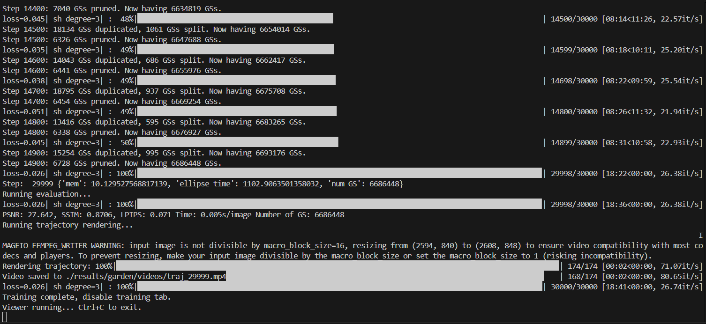
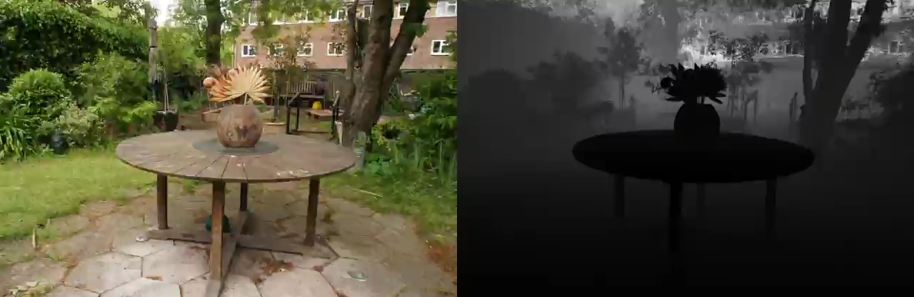
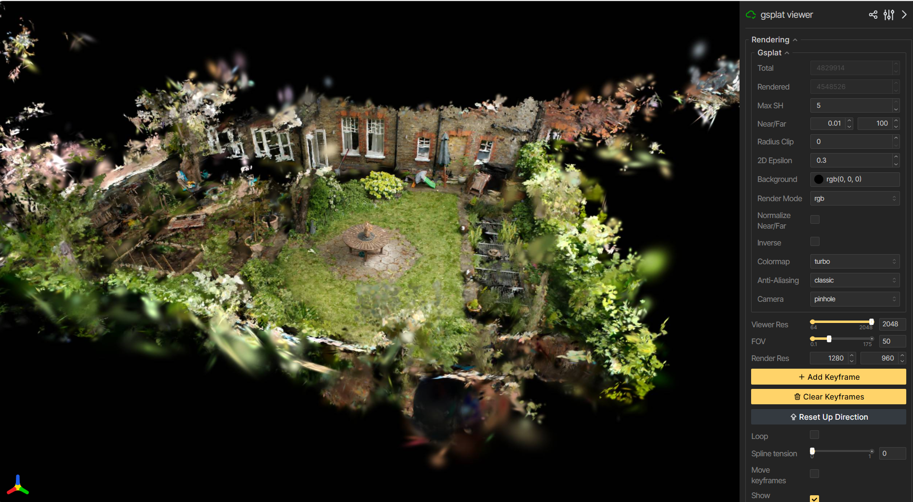

.. meta::
  :description: gsplat examples
  :keywords: gsplat, ROCm, example, sample, tutorial

.. _run-a-gsplat-example:

********************************************************************
Run a gsplat example
********************************************************************

A set of examples is available to help you get started with gsplat (Gaussian splatting).

1. Clone the repository and check out the examples folder:

   .. code-block:: bash

      git clone --no-checkout https://github.com/rocm/gsplat.git
      cd gsplat
      git sparse-checkout init --cone
      git sparse-checkout add examples
      git checkout main

2. Install the dependencies and download the test dataset:

   .. code-block:: bash

      cd examples
      pip install -r requirements.txt
      python datasets/download_dataset.py

3. You can then run the provided examples below.

* :ref:`fit-a-single-image`
* :ref:`fit-a-single-2d-image-with-gaussians`
* :ref:`render-large-scene-real-time`

Examples
====================================================================

This section provides example scripts to help you get started with gsplat.

.. _fit-a-single-image:

Fit a single image
--------------------------------------------------------------------

The ``examples/image_fitting.py`` script tests the rasterization process on a set of random Gaussians.  
It recreates a photograph using many small, colorful blobs (Gaussians).  
The script also demonstrates differentiability on a single training image.

Run the example:

.. code-block:: bash

   python image_fitting.py --height 256 --width 256 --num_points 2000 --save_imgs

Output:  

- Training progress is saved as an animated GIF in the ``results`` folder.    

.. image:: ../images/training_fit_single_image.gif
   :alt: Example of single image Gaussians output

.. _fit-a-single-2d-image-with-gaussians:

Fit a single 2D image with 3D Gaussians 
--------------------------------------------------------------------

This example trains a 3D Gaussian splatting model for novel view synthesis using a **COLMAP-processed capture**.  
For reference, see the `Fit a COLMAP Capture <https://docs.gsplat.studio/main/examples/colmap.html>`__ documentation resource. 

A COLMAP capture includes:  

- Original 2D images  
- Calculated camera positions and orientations for each image  
- A 3D point cloud serving as an initial guess for the scene’s geometry  

Run the trainer:

.. code-block:: bash

   CUDA_VISIBLE_DEVICES=0 python simple_trainer.py default \
       --data_dir data/360_v2/garden/ --data_factor 4 \
       --result_dir ./results/garden

Output:  

- Training takes some time to complete.  
- During training, a **Viser link** appears in the output. Open it in your browser for real-time rendering.  
- After training, you can open the saved video stored in the ``results`` directory.  

Note: If the localhost link does not work, use your system hostname followed by the port number.  

.. _render-large-scene-real-time:

Render a large scene in real time 
--------------------------------------------------------------------

This example demonstrates rendering a **large scene** by replicating the Garden scene into a 9x9 grid,  
producing 30M Gaussians in total. gsplat still achieves real-time rendering.  

The key technique is to **ignore distant Gaussians** using a radius threshold.  
This is configured in the ``rasterization()`` API through ``radius_clip``.  

1. Train a 3DGS model:

   .. code-block:: bash

      CUDA_VISIBLE_DEVICES=0 python simple_trainer.py default \
          --data_dir data/360_v2/garden/ --data_factor 4 \
          --result_dir ./results/garden

2. View the scene in a viewer with gsplat:

   - With Scene Grid:

     .. code-block:: bash

        CUDA_VISIBLE_DEVICES=0 python simple_viewer.py --scene_grid 5

     .. image:: ../images/viewer_gsplat_scene_grid.png
        :alt: Example viewer rendering with Scene Grid

   - With Simple Viewer:

     .. code-block:: bash

        CUDA_VISIBLE_DEVICES=0 python simple_viewer.py \
            --ckpt results/garden/ckpts/ckpt_6999_rank0.pt

     .. image:: ../images/viewer_gsplat_simple_viewer.png
        :alt: Example viewer rendering from a saved checkpoint
